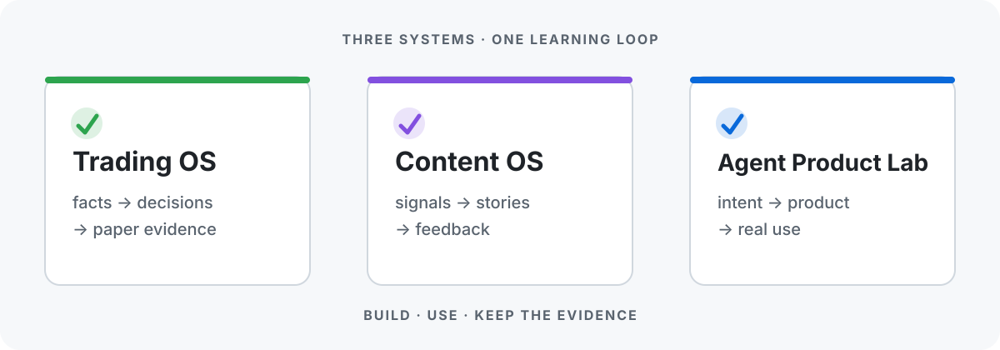

<div align="center">

# Park

**I build AI-agent operating systems for markets, content, and product creation.**

用 AI Agent 把交易、内容与产品创造，变成可以持续运行和学习的系统。

上海 · Builder · Systems thinker

</div>



## The full picture

我不是在收集互不相干的 repo。我在搭三套相互连接的操作系统：

| System | Outcome | Current focus |
|---|---|---|
| **Trading OS** | 从市场事实走到受约束的交易决策与复盘 | Paper-first 闭环与可审计证据 |
| **Content OS** | 从内容信号走到跨平台成品与反馈学习 | 独立 capability 串成生产系统 |
| **Agent Product Lab** | 从产品意图走到真实使用证据 | Build → ready gate → Use 的交接闭环 |

`READY` 可用入口与核心结果明确 · `BUILDING` 正在形成完整产品 · `EXPLORING` 仍在验证方向

---

## Trading OS

> **Outcome:** 把多市场数据转成有来源、有风控、有执行证据的决策闭环。当前坚持 paper-first；不在这里宣称真钱能力已经开放。

### System map

```text
Market facts          Understanding          Decision             Learning

01 Data        ──▶ 02 Intelligence ──▶ 03 Signal       ──▶ 04 Method routing
   READY              READY                BUILDING          BUILDING
      │
      ▼
05 Backtest    ──▶ 06 Risk plan    ──▶ 07 Paper execution ──▶ 08 Journal
   READY              BUILDING             BUILDING              EXPLORING
```

### Products

| Product | Role in the system | Status |
|---|---|---|
| [datafeed](https://github.com/zinan92/datafeed) | ticker + timeframe → multi-market OHLCV | `READY` |
| [intel](https://github.com/zinan92/intel) | 10+ sources → scored, clustered market events | `READY` |
| [equity-research](https://github.com/zinan92/equity-research) | evidence snapshots → A-share investment-committee research | `BUILDING` |
| [backtest](https://github.com/zinan92/backtest) | strategy definition → win rate, payoff and drawdown | `READY` |
| [standard-kline](https://github.com/zinan92/standard-kline) | OHLCV + provenance → trustworthy chart surface | `READY` |

### Now / Next

- **Now** — 强化从行情、情报、策略到 Paper 执行的可审计闭环；把“代码存在”和“真实运行证据”分开。
- **Next** — 用完整周期证据验证多资产闭环，再决定哪些能力值得进入更高风险阶段。

<details>
<summary><strong>More context</strong></summary>

- [quant-data-pipeline](https://github.com/zinan92/quant-data-pipeline) 是早期多市场数据与信号能力的集成底座。
- 私有执行与风控实现不会从 Profile 暴露；公开页面只描述能力边界和已验证状态。
- Backtest 是辅助证据，不自动等于策略可交易，更不等于 live-ready。

</details>

---

## Content OS

> **Outcome:** 让创作者负责判断与表达，让系统处理发现、获取、理解、生产、组装、分发和反馈。

### System map

```text
Discover             Understand             Create                Learn

01 Signals     ──▶ 02 Acquire       ──▶ 03 Extract      ──▶ 04 Curate
   BUILDING           READY                 READY                EXPLORING
      │
      ▼
05 Rewrite     ──▶ 06 Assemble      ──▶ 07 Publish      ──▶ 08 Performance
   READY              READY                 BUILDING             EXPLORING
```

### Products

| Product | Role in the system | Status |
|---|---|---|
| [content-intelligence](https://github.com/zinan92/content-intelligence) | social data → trends, patterns and topic signals | `BUILDING` |
| [content-downloader](https://github.com/zinan92/content-downloader) | platform URL → normalized media + metadata | `READY` |
| [content-extractor](https://github.com/zinan92/content-extractor) | video / image / article → structured text | `READY` |
| [content-rewriter](https://github.com/zinan92/content-rewriter) | source material → platform-specific drafts | `READY` |
| [videocut](https://github.com/zinan92/videocut) | talking-head footage → edited video assets | `READY` |
| [daily-newsletter](https://github.com/zinan92/daily-newsletter) | source feeds → selected Chinese daily brief + receipts | `READY` |

### Now / Next

- **Now** — 独立能力已经覆盖获取、理解、改写和视频组装；重点是让它们以清晰合同协作，而不是继续堆工具。
- **Next** — 补齐 curator 与 performance feedback，让选题质量和发布结果能够回流到下一轮生产。

<details>
<summary><strong>More context</strong></summary>

- [seedance-expert](https://github.com/zinan92/seedance-expert) 把视频创意转成可执行的多模态生成提示。
- [AI-videos](https://github.com/zinan92/AI-videos) 探索虚拟人物换装与动作迁移工作流。
- 已归档的 orchestrator 和 workbench 保留为历史证据，不再占据主地图。

</details>

---

## Agent Product Lab

> **Outcome:** 把独立产品想法做成 ready for use 的产品，再用真实任务验证价值，把缺口送回 Build。

### System map

```text
Intent              Build                 Gate                 Use

01 Explore    ──▶ 02 Product build ──▶ 03 Readiness     ──▶ 04 Real tasks
   READY             BUILDING             READY                BUILDING
                                                                  │
                                                                  ▼
                   06 Improve      ◀── 05 Evidence
                      READY              READY
```

### Products

| Product | Role in the system | Status |
|---|---|---|
| [proactive-explorer](https://github.com/zinan92/proactive-explorer) | existing product → evidence-backed next direction | `READY` |
| [doc-driven-dev-workflow](https://github.com/zinan92/doc-driven-dev-workflow) | intent → reviewable development stages and guards | `READY` |
| [wechat-miniprogram-shipping](https://github.com/zinan92/wechat-miniprogram-shipping) | product intent → release contract and evidence path | `READY` |
| [repo-evals](https://github.com/zinan92/repo-evals) | product claims → reproducible verdict dossier | `READY` |
| [loop](https://github.com/zinan92/loop) | repo + contract → value-ranked issues, PRs and digest | `READY` |
| [codex-harness](https://github.com/zinan92/codex-harness) | local agent sessions → project and token evidence | `BUILDING` |

### Now / Next

- **Now** — Product Lab 已明确分成 **Build** 与 **Use**：Build 对 readiness 负责，Use 对真实任务与使用证据负责。
- **Next** — 把 ready handoff、真实使用、缺口复现和回流需求做成跨产品可复用的证据链。

<details>
<summary><strong>Operating rule</strong></summary>

```text
Intent → Issue contract → Build → Readiness gate → Real use → Evidence → Next issue
```

绿测试证明代码通过了测试，不自动证明产品 ready；部署成功也不自动证明用户结果已经发生。

</details>

---

## How the systems connect

```text
                 ┌─────────────────────────┐
                 │    Agent Product Lab    │
                 │  builds + tests + learns│
                 └────────────┬────────────┘
                              │
                     product capabilities
                              │
             ┌────────────────┴────────────────┐
             ▼                                 ▼
       ┌────────────┐                    ┌────────────┐
       │ Trading OS │                    │ Content OS │
       │ decisions  │                    │ production │
       └─────┬──────┘                    └─────┬──────┘
             └──────────── evidence ───────────┘
                              │
                              ▼
                       better next build
```

三套系统共享同一条原则：**先定义结果，再建立可复验合同；系统必须诚实表达 READY、BUILDING 和 EXPLORING。**

## Working together

如果你也在构建 agent-native 产品、研究系统或内容基础设施，可以从相关 repo 的 issue 开始交流。最好的合作入口不是“聊一个大想法”，而是一个清楚的问题、输入、期望输出和失败边界。

<div align="center">

_Build the system. Use the system. Keep the evidence._

</div>
